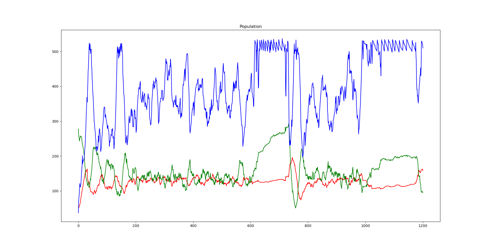
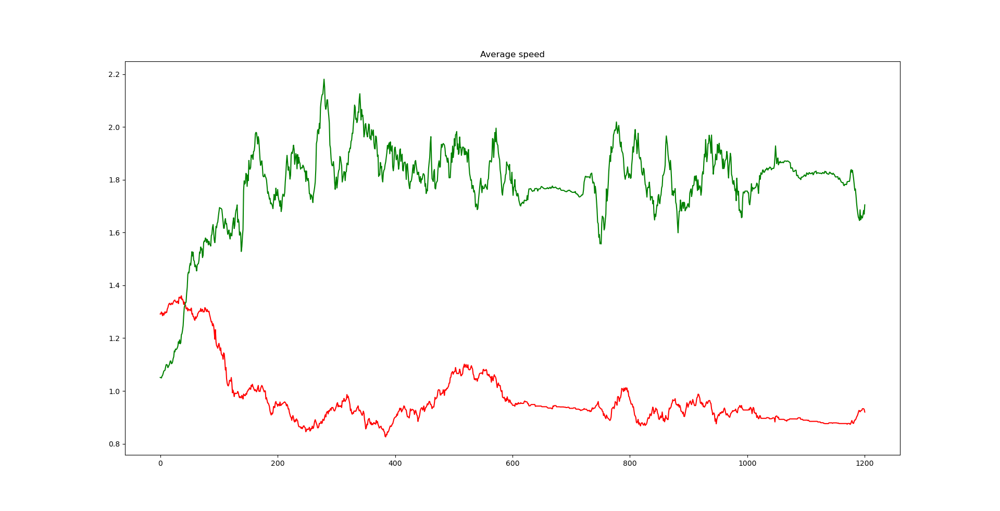
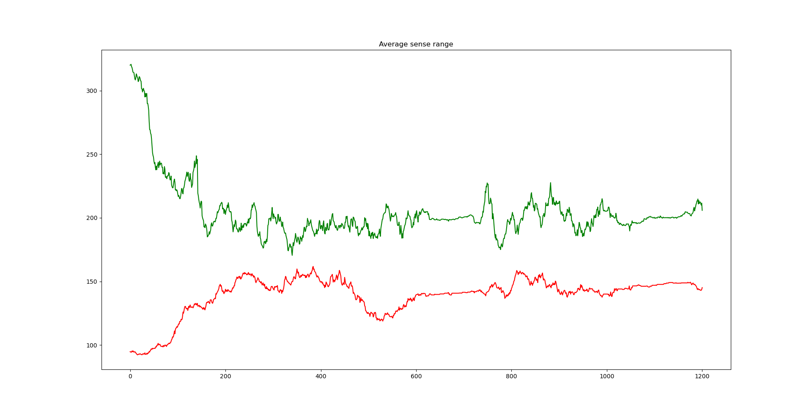
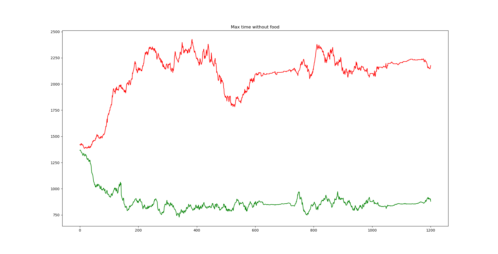
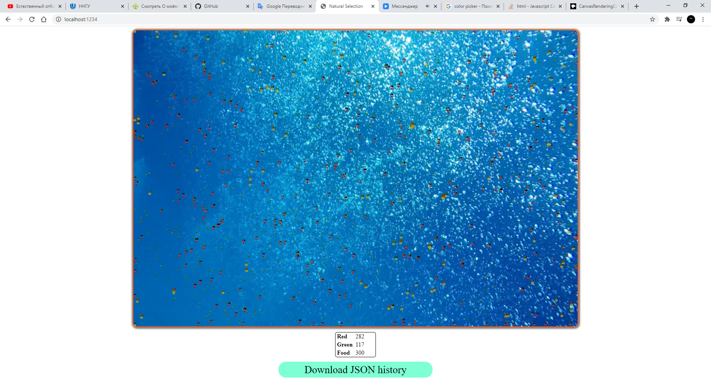

# Natural Selection

This typical project. It has bacterias of any types and food. They mutate and live 
together. Python script creates graphic with mutatable properties of bacterias.

Using html canvas for demonstration.

Examples for graphics:

Example for html canvas (enlarged scale):
